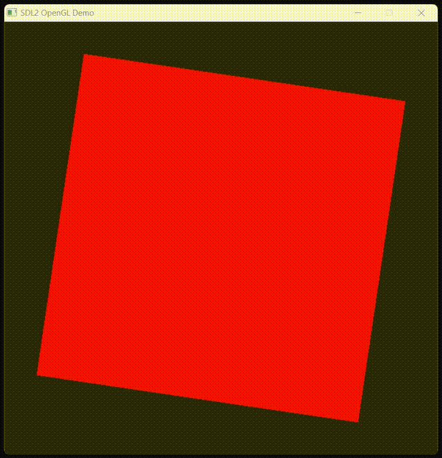
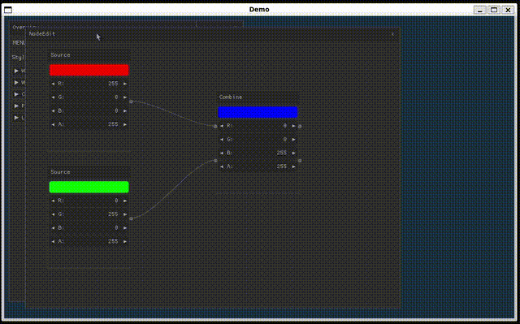

# CJIT for graphical applications

Be welcome to the exciting world of graphical C applications using SDL
([Simple DirectMedia Layer](https://sdl.org)). SDL, originally
developed by Sam Lantinga in 1998, is a powerful, cross-platform
library designed to provide low-level access to audio, keyboard,
mouse, and graphics hardware via OpenGL and Direct3D.

::: warning
This part of the tutorial may be incomplete for Apple/OSX, please help testing and refining it!
:::

## Download the cjit-demo package

From now on this tutorial will guide you to launch more complex
applications, showing how to use libraries that are installed on your
system and shipped along with the source code.

To set up the demo environment you can simply run the command below:

#### MS/Windows

```
iex ((New-Object System.Net.WebClient).DownloadString('https://dyne.org/cjit/demo'))
```

#### GNU/Linux & Apple/OSX

```bash
curl -sL https://dyne.org/cjit/demo.sh | bash
```


## The Beauty of Random

Execute [sdl2_noise.c](https://github.com/dyne/cjit/blob/main/examples/sdl2_noise.c) passing the source file as argument to CJIT, and since we are also using the SDL2 library we also need an extra parameter:

#### MS/Windows

```
.\cjit.exe examples/sdl2_noise.c SDL2.dll
```

#### GNU/Linux & Apple/OSX

```bash
./cjit examples/sdl2_noise.c -lSDL2
```


::: info
This preview looks blurred because video compression cannot deal well with randomness.
:::

Have a look inside [sdl2_noise.c](https://github.com/dyne/cjit/blob/main/examples/sdl2_noise.c), and see the first line of code:

### The "hashbang"

```sh
#!/usr/bin/env cjit
```

The source file can be launched as a script, when the CJIT interpreter is found in PATH.

::: warning
The hashbang works only on Apple/OSX and GNU/Linux, where scripts can be made executable with `chmod +x`.
:::

### The pragma lib

Also see this pre-processor directive:

```c
#pragma comment(lib, "SDL2")
```

This line tells CJIT to link the `SDL2` shared library. It is the equivalent of `SDL2.dll` on the command line, with the only difference that it can be specified inside the source code.

::: info
On Windows the DLL files need to be in the same directory of execution, or installed system-wide.
:::

## Three Dimensions

To draw accelerated graphics and 3D objects we'll use OpenGL libraries, which need to be installed on the system.

#### MS/Windows

[Install the Windows SDK](https://developer.microsoft.com/en-us/windows/downloads/windows-sdk/) which is distributed gratis by Microsoft.

#### Apple/OSX

Not sure yet. Help testing this please.

#### GNU/Linux

```bash
sudo apt-get install libopengl-dev
```

Then run CJIT passing the file [examples/opengl.c](https://github.com/dyne/cjit/blob/main/examples/opengl.c) as argument, along with the same parameter to link SDL2.



For more details on using OpenGL and SDL2 in C with shaders, read the
[multi-platform-modern-opengl-demo-with-sdl2
tutorial](https://shallowbrooksoftware.com/posts/a-multi-platform-modern-opengl-demo-with-sdl2/)
on which our example code is based.

## Nuklear widgets

Nuklear is a minimal, immediate-mode graphical user interface toolkit
written in ANSI C and licensed under public domain. It is designed to
be lightweight and highly customizable, and provides a wide range of
components, including buttons, sliders, text input fields, and more,
all of which can be integrated seamlessly with CJIT.

This time the code of our example is distributed across multiple files. This is a quick overview of what is found inside the `examples` folder:

```
.
├── nuklear
│   ├── calculator.c
│   ├── canvas.c
│   ├── node_editor.c
│   ├── overview.c
│   └── style.c
├── nuklear.c
└── nuklear.h
```

The main code of our example
is
[examples/nuklear.c](https://github.com/dyne/cjit/blob/main/examples/nuklear.c) and by default it will just start all modules.

Fire it up as usual with `./cjit.exe examples/nuklear.c` on MS/Windows or `./cjit examples/nuklear.c` on GNU/Linux and Apple/OSX.

And enjoy Nuklear!


